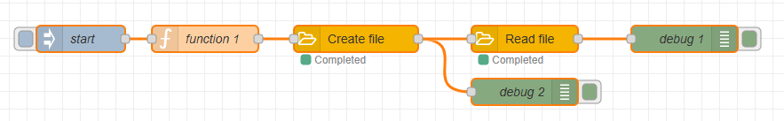
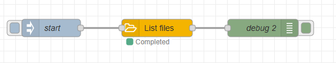
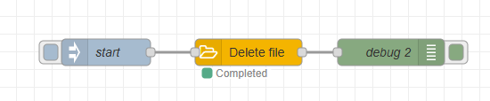

# node-red-contrib-google-drive

A Node-RED package that provides nodes to interact with Google Drive.

## Features
- List files in a Google Drive folder
- Create folders in Google Drive
- Create, read, update, and delete files in Google Drive
- Automatic handling of tokens and refresh_tokens

## Authentication

To authenticate with Google Drive, **you need to create OAuth 2.0 credentials in the Google Cloud Console**. Please note that You need to have access to the google cloud console with a google account, which means you need to **setup a payment method**, even if you stay within the free tier.

Here's a brief overview of the steps involved:
- Go to the [Google Cloud Console](https://console.cloud.google.com/).
- Create a new project or select an existing one.
- Navigate to "APIs & Services" > "OAuth Consent Screen" and configure the consent screen for your application. 
  Fill the required fields:
    - Application name: `NodeREDGoogleDrive` 
    - Support email: your email
    - Audience: `External` (Otherwise refres tokens will be very short-lived and requires frequent human interaction for re-authentication)

- Navigate to "APIs & Services" > "Clients".
- Click on "Create Credentials" and select "OAuth 2.0 Client IDs":
    - Select "Web application" as the application type.
    - Redirect URIs: your Node-RED instance URL followed by `/google-drive/auth/callback` (e.g., `http://localhost:1880/google-drive/auth/callback`).

- Download the credentials JSON file and securely store it.

After setting up the OAuth 2.0 credentials, follow these steps to configure the Google Drive node in Node-RED:
- Drag&drop a Google Drive node into your Node-RED workspace.
- Double-click the node to open its configuration dialog, then click on the pencil icon next to the "Google Credentials" field to add a new credential.
- Use the data from the previously downloaded JSON file to fill in the required fields:
    - Client ID
    - Client Secret
    - Redirect URI: the same redirect URI you specified in the Google Cloud Console.
    - Scopes: `https://www.googleapis.com/auth/drive`
- **Deploy** The configuration to persist the credentials. 
- Reopen the Google Drive node configuration and click on the "Authenticate" button to initiate the OAuth 2.0 flow. Follow the prompts to authorize the application to access your Google Drive. This will generate and store the necessary tokens for future uses.

## Nodes docs

See [NODE_DOCS.md](./NODE_DOCS.md) for detailed documentation of each node and its functionality.

## Usage examples

### Create a file and read it back
Create a file in a specified folder and read it back:

- folderId: ID of the folder to list contents from. Get it from your browser's address bar when you are inside the folder in Google Drive: https://drive.google.com/drive/folders/`<folderId>`

[JSON flow here](./examples/create-read.json)

### List content of a directory 

List all files and folders in a specified Google Drive folder:

- folderId: ID of the folder to list contents from. Get it from your browser's address bar when you are inside the folder in Google Drive: https://drive.google.com/drive/folders/`<folderId>`

[JSON flow here](./examples/list-files.json)

### Delete a file
Delete a specified file from Google Drive:
- fileId: ID of the file to delete. Get it from your browser's address bar when you have the file selected in Google Drive: https://drive.google.com/file/d/`<fileId>`/view, or from the output of a "List Files" node.

[JSON flow here](./examples/delete-file.json)